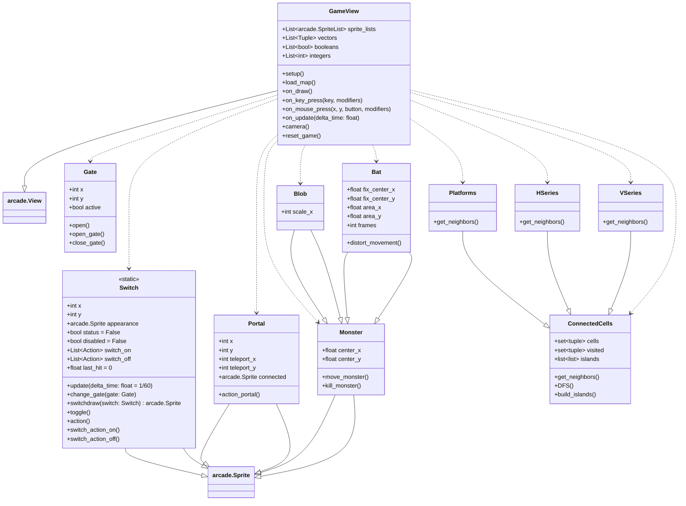

# Design

## Class Diagram

```mermaid
classDiagram

%% Base Arcade types (no boxes)
GameView --|> arcade.View
Monster --|> arcade.Sprite
Switch --|> arcade.Sprite
Portal --|> arcade.Sprite
Bat --|> Monster
Blob --|> Monster

%% GameView
class GameView {
    +List~arcade.SpriteList~ sprite_lists
    +List~Tuple~ vectors
    +List~bool~ booleans
    +List~int~ integers

    +setup()
    +load_map()
    +on_draw()
    +on_key_press(key, modifiers)
    +on_mouse_press(x, y, button, modifiers)
    +on_update(delta_time: float)
    +camera()
    +reset_game()
}

%% GameView dependencies (imports)
GameView ..> Gate
GameView ..> Switch
GameView ..> Portal
GameView ..> Monster
GameView ..> Blob
GameView ..> Bat
GameView ..> Platforms
GameView ..> HSeries
GameView ..> VSeries
GameView ..> ConnectedCells

%% Monster base
class Monster {
    +float center_x
    +float center_y

    +move_monster()
    +kill_monster()
}

%% Blob subclass
class Blob {
    +int scale_x
}

%% Bat subclass
class Bat {
    +float fix_center_x
    +float fix_center_y
    +float area_x
    +float area_y
    +int frames

    +distort_movement()
}

%% Gate
class Gate {
    +int x
    +int y
    +bool active

    +open()
    +open_gate()
    +close_gate()
}

%% Switch
class Switch {
    +int x
    +int y
    +arcade.Sprite appearance
    +bool status = False
    +bool disabled = False
    +List~Action~ switch_on
    +List~Action~ switch_off
    +float last_hit = 0

    +update(delta_time: float = 1/60)
    +change_gate(gate: Gate)
    <<static>>
    +switchdraw(switch: Switch) arcade.Sprite

    +toggle()
    +action()
    +switch_action_on()
    +switch_action_off()
}

%% Portal
class Portal {
    +int x
    +int y
    +int teleport_x
    +int teleport_y
    +arcade.Sprite connected

    +action_portal()
}

%% ConnectedCells hierarchy

class ConnectedCells {
    +set~tuple~ cells
    +set~tuple~ visited
    +list~list~ islands

    +get_neighbors()
    +DFS()
    +build_islands()
}

class Platforms {
    +get_neighbors()
}

class HSeries {
    +get_neighbors()
}

class VSeries {
    +get_neighbors()
}

Platforms --|> ConnectedCells
HSeries --|> ConnectedCells
VSeries --|> ConnectedCells

%% Inheritance connections
Monster --|> arcade.Sprite
Switch --|> arcade.Sprite
Portal --|> arcade.Sprite
Blob --|> Monster
Bat --|> Monster


```

