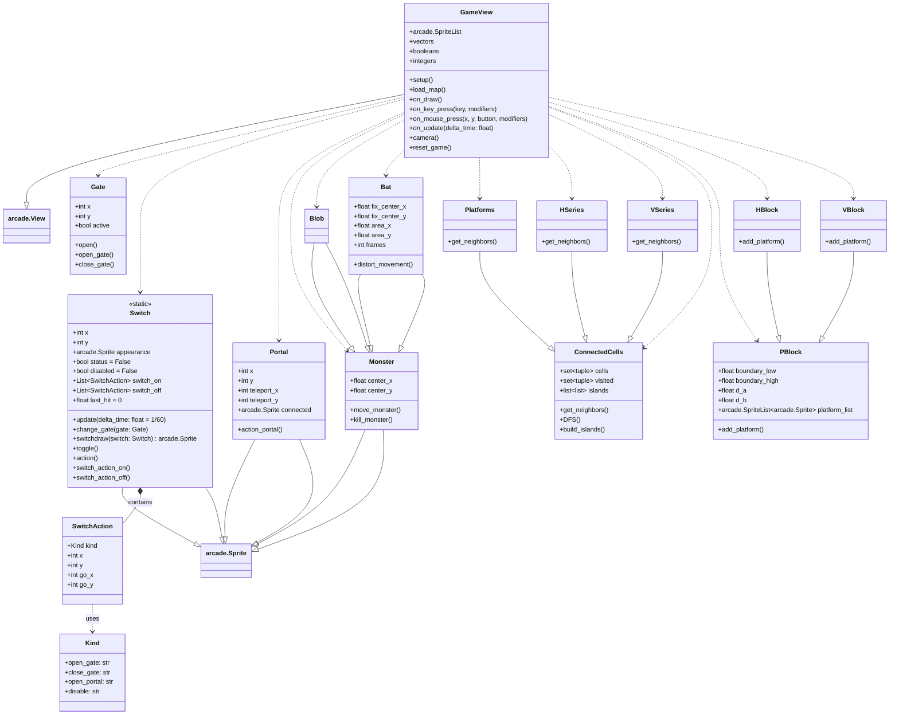

# Design

## Class Diagram

## Analyse de Complexité — `load_level`

Nous pouvons calculer la complexité théorique de nos deux fonctions comme suit :

### `load_level`

Notre fonction, qui charge la map et s'occupe des mouvements des blocs, commence par lire sur chaque ligne les signes présents dans le dictionnaire de symboles.  
Nous sommes donc en **O(n)**.

Or, chaque cellule qui est une liste de blocs avec leurs positions est ensuite de nouveau parcourue pour créer le chemin des plateformes. Mais la fonction doit aussi parcourir les colonnes également. Donc la fonction doit parcourir ligne et colonne. Ainsi, on se retrouverait donc en au plus **O(n x m)**.

> Où `n` et  `m` sont les lignes et colonnes de la map.  
> Cependant on peut noter qu'il y a une très légère variation de temps de chargement entre les agmentations d'entités comme expliqué ci-dessous.

### Temps d'exécution de `load_level` en fonction du nombre de blobs

# Analyse des Temps d'Exécution - Fonction `load_level`
Ici, nous avons choisi l'augmentation de la taille de la carte en la déboublant, triplant et quadruplant respectivement.

## Données Mesurées

### Taille Double

| Maps | Temps Initial (s)  | Temps après doublement en (s) |
|------|---------------------|------------------------------|
| 1    | 0.03351596666005207 | 0.040215169260045515       |
| 2    | 0.019983616679965052| 0.0320184125599917         |
| 3    | 0.04681863809993956 | 0.08216843231988605        |
| 4    | 0.06654813448985805 | 0.113655074039998          |
| 5    | 0.0669925301198964  | 0.11534706244012341        |
| 6    | 0.09267762753996067 | 0.14442784916987875        |

### Taille Triple

| Maps | Temps Initial (s)  | Temps après triplement en (s) |
|------|---------------------|------------------------------|
| 1    | 0.032971278479963076| 0.0571959967300063         |
| 2    | 0.02034850926982472 | 0.044654004339827226       |
| 3    | 0.047207479130011054| 0.11939582519000397        |
| 4    | 0.06652169388020411 | 0.16705413240008057        |
| 5    | 0.06690142965991981 | 0.16539370810001855        |
| 6    | 0.09296518293995178 | 0.21798782810015838        |

### Taille Quadruple

| Maps | Temps Initial (s)  | Temps après quadruplement en(s) |
|------|---------------------|------------------------------|
| 1    | 0.03246971748012584 | 0.07324903425003867        |
| 2    | 0.019971132370119448| 0.056986552150046915       |
| 3    | 0.047092262300138826| 0.15945707021979616       |
| 4    | 0.06792413585993927 | 0.23046211311011575       |
| 5    | 0.06827231192990439 | 0.22642493391002064       |
| 6    | 0.0931125046897796  | 0.2917219901300268        |

---

## Visualisation et Analyse

- Les temps après augmentation sont **sensiblement plus élevés** que les temps initiaux, mais l’écart reste proportionnel.
- Pour le changement de taille, les rapports de temps augmentent mais restent globalement **linéaires**.

### Rapports Moyens (approximation)

| Taille de la Carte | Rapport moyen (temps après / temps initial) |
|---------------------|---------------------------------------------|
| Double              | ~ 1.5 - 1.7                                |
| Triple              | ~ 2.3 - 2.5                                |
| Quadruple           | ~ 3 - 3.2                                  |

---

## Conclusion sur la Complexité

La fonction **`load_level`** semble présenter une **complexité proche de linéaire (O(n x m))** :  
Les temps d’exécution n’augmentent que peu lorsque la taille des données est doublée, triplée ou quadruplée.  

## Analyse de Complexité — `on_update`

Ici, on peut calculer chaque partie que exécute la fonction `on_update`.  
La plupart des calculs se font à travers la recherche d'éléments dans une liste.

À chaque fois qu'on fait une recherche, une suppression, un ajout ou une vérification de collision, on est en **O(n)**,  
où `n` est le nombre d’éléments dans la liste.

Or, certains éléments (flèches, etc.) dépendent d'autres paramètres comme les murs, les plateformes, ou encore la taille de la map.  
Ainsi, presque chaque liste varie entre **O(n)** et **O(n²)**.

En sommant chaque portion de code, on peut conclure que la complexité globale de notre fonction `on_update` se rapproche de **O(n²)**.

# Analyse des Temps d'Exécution
Pour tester les performances de la fonction nous avons choisi le fait d'augmenter les entités présentes par cartes. Ainsi on peut voir comment la fonction se comporte lors de gros amas de monstres.

## Mesures

| Maps | Temps Initial  (s)   |temps après augmentation de 250 entités |
|------|---------------------|------------------------------           |
| 1    | 0.0002614976830082014 | 0.0008421041060064454                 |
| 2    | 0.0002620382030145265 | 0.001358495810010936                  |
| 3    | 0.0002545341759978328 | 0.06340233693100163                   |
| 4    | 0.00041971688999910836| 0.06296813303400996                   |
| 5    | 0.00022044210400781595| 0.001094399881985737                  |
| 6    | 0.000241684228007216  | 0.0019125435989990364                 |

## Intérpretation

- On voit nettement une grosse augmentation du temps entre la map initiale et celle augmentée.
- La croissance est donc au moins linéaire.

## Résultats

- **Rapport moyen des temps après augmentation / temps initial** : environ **69**.
- Cela suggère une augmentation des temps d’exécution bien plus forte qu’une croissance linéaire.

## Conclusion sur la Complexité

Les résultats empiriques suggèrent une **complexité quadratique (O(n²))**.  
On remarque l’augmentation est beaucoup plus marquée, indiquant la présence de boucles imbriquées ou d’interactions croisées qui font croître le coût en **O(n²)** ou encore une fois `n` est le nombre de lignes.

